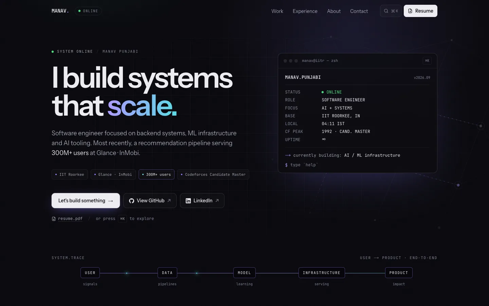
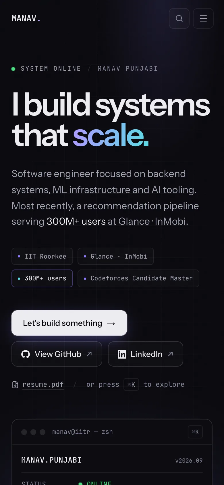

# Manav Punjabi — Portfolio

Personal site of **Manav Punjabi** — software engineer working on backend systems, ML infrastructure and AI tooling (IIT Roorkee, ECE '27).

It is built like a small engineering console rather than a template: every section is a system diagram, a measured result, or something you can poke at.



<p align="center">
  
</p>

## Tech stack

| Layer      | Choice                                                                          |
| ---------- | ------------------------------------------------------------------------------- |
| Framework  | Next.js 16 (App Router, Turbopack), React 19, TypeScript                        |
| Styling    | Tailwind CSS 4 with design tokens in `globals.css`                              |
| Motion     | Framer Motion (lazy-loaded features) + CSS keyframes for anything pre-hydration |
| Icons      | Lucide, plus inline brand marks                                                 |
| Fonts      | Instrument Sans + JetBrains Mono via `next/font`                                |
| OG / icons | `next/og` `ImageResponse`, generated at build time                              |
| Quality    | ESLint (flat config), Prettier + Tailwind class sorting, `tsc --noEmit`         |
| Hosting    | Vercel                                                                          |

No Three.js: the diagrams are SVG and CSS, which gave the same "system coming online" feel at a fraction of the bundle cost.

## Features

- **Boot-sequence hero** with a live console (`help`, `whoami`, `open github`, `sudo hire manav`, …) and an animated user → product system trace.
- **Experience as case studies** — an expandable recommendation-pipeline architecture (Glance), a production status console (Airblack) and an interactive steganography channel simulation (NOOS).
- **Project case studies** — the self-correcting agent loop, a model benchmark bracket and a two-lane RAG diagram, plus an explorer for smaller builds.
- **Across-the-stack map** — filter by any role or project to see which layers (algorithms → production) it touches.
- **Live Codeforces rating history** from the public API (refreshed daily, with a verified snapshot fallback) and a knight's tour generated with Warnsdorff's rule.
- **Command palette** — `⌘K` / `Ctrl K`, full keyboard navigation, focus management.
- **Details** — scroll reveals that respect `prefers-reduced-motion` and still render without JavaScript, a subtle cursor on fine pointers only, a floating contact dock, blueprint mode (↑↑↓↓←→←→BA), and a note for anyone who opens DevTools.
- **SEO** — metadata, canonical URL, Open Graph/Twitter cards, JSON-LD `Person`, sitemap, robots and web manifest.

## Architecture

```
src/
├─ app/                    routes + file-based metadata
│  ├─ layout.tsx           fonts, metadata, global chrome
│  ├─ page.tsx             section composition (server component, ISR: 1 day)
│  ├─ opengraph-image.tsx  OG/Twitter card (next/og), fonts in _og/
│  ├─ icon.svg, apple-icon.tsx, favicon.ico
│  └─ robots.ts, sitemap.ts, manifest.ts, not-found.tsx
├─ content/site.ts         every fact on the site, in one typed file
├─ components/
│  ├─ chrome/              navbar, command palette, cursor, reveal observer, toasts
│  ├─ hero/                hero + interactive console
│  ├─ sections/            one file per section (server components)
│  ├─ visuals/             interactive diagrams (client components)
│  └─ ui/                  primitives and icons
└─ lib/                    site URL, hooks, Codeforces client, knight's tour
```

Design decisions:

- **Server-first.** Sections are server components; only the pieces that react to input are client components.
- **One reveal observer.** Server markup opts into scroll reveals with a `data-reveal` attribute; a single `IntersectionObserver` shows them. Content is only hidden under `@media (scripting: enabled)`, so it never disappears without JS.
- **LCP-safe hero.** The headline animates by transform only, so it paints on the first frame.
- **Content is data.** `src/content/site.ts` is the single source of truth. Every metric in it traces back to the resume, a public repository or the Codeforces API.

## Local development

```bash
npm install
npm run dev          # http://localhost:3000
npm run build        # production build
npm run lint         # ESLint
npm run typecheck    # tsc --noEmit
npm run format       # Prettier
```

Optional environment variables are documented in [`.env.example`](.env.example).

## Deployment

The site deploys to Vercel from `main`. No configuration is required:

- `VERCEL_PROJECT_PRODUCTION_URL` is picked up automatically for canonical URLs, the sitemap and OG tags.
- Set `NEXT_PUBLIC_SITE_URL` once a custom domain is attached.
- Set `NEXT_PUBLIC_PLAUSIBLE_DOMAIN` to enable cookie-free analytics; nothing loads otherwise.

To regenerate `favicon.ico` after editing `src/app/icon.svg`: `node scripts/generate-favicon.mjs`.

## Performance

Lighthouse 13 against a local production build (`next start`):

| Profile | Performance | Accessibility | Best Practices | SEO |
| ------- | ----------- | ------------- | -------------- | --- |
| Desktop | 100         | 100           | 100            | 100 |
| Mobile  | 93–94       | 100           | 100            | 100 |

Mobile runs use Lighthouse's simulated slow-4G throttling. CLS ≤ 0.03, TBT ≤ 60 ms.

## Contact

- Email — [manav_ap@ece.iitr.ac.in](mailto:manav_ap@ece.iitr.ac.in)
- LinkedIn — [manav-punjabi-861122282](https://www.linkedin.com/in/manav-punjabi-861122282)
- GitHub — [@Independentfox](https://github.com/Independentfox)
- Codeforces — [Akaza_3](https://codeforces.com/profile/Akaza_3)
