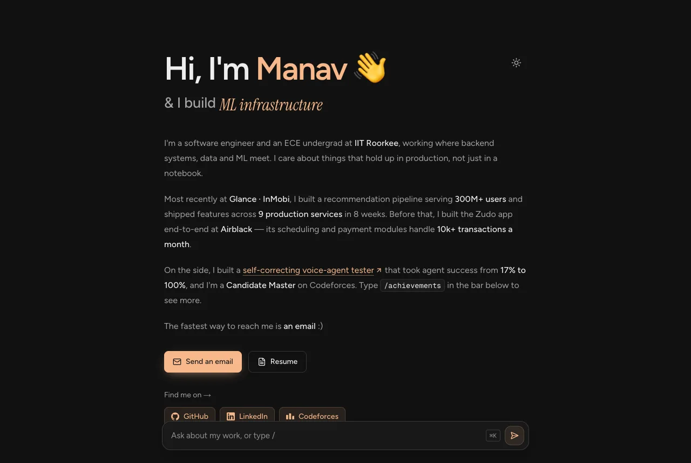
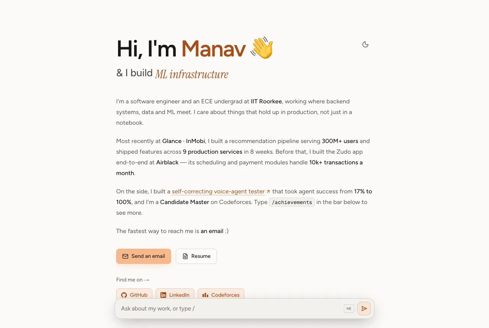
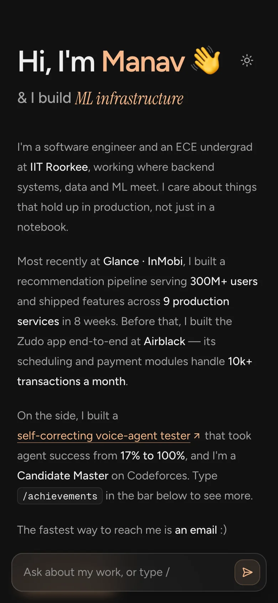

# Manav Punjabi — Portfolio

**Live → [manav-punjabi-portfolio.vercel.app](https://manav-punjabi-portfolio.vercel.app)**

Personal site of **Manav Punjabi** — software engineer working on backend systems, ML infrastructure and AI tooling (IIT Roorkee, ECE '27).

A deliberately minimal, single-column page: a short bio, the work that matters, and a command bar at the bottom for everything else.



<p align="center">
  
  &nbsp;
  
</p>

## Features

- **Command bar** — pinned to the bottom. Type `/` (or press `/` / `⌘K` anywhere) for `/about`, `/experience`, `/projects`, `/achievements`, `/cp`, `/stack`, `/contact` and `/resume`. Plain questions like _"where have you worked?"_ are routed to the closest command. It's deliberately not an AI — no API key, no cost.
- **Light & dark themes** — dark by default, remembered per visitor, no flash on load.
- **Experience accordion** with animated height (CSS grid rows, no JS measuring).
- **Live Codeforces card** — rating history and problems solved from the public API, refreshed daily, with a verified snapshot fallback.
- **Details** — a rotating serif tagline, a waving hand, scroll reveals that respect `prefers-reduced-motion` and still render without JavaScript.
- **SEO** — metadata, canonical URL, generated Open Graph/Twitter card, JSON-LD `Person`, sitemap, robots and web manifest.

## Tech stack

| Layer      | Choice                                                                   |
| ---------- | ------------------------------------------------------------------------ |
| Framework  | Next.js 16 (App Router, Turbopack), React 19, TypeScript                 |
| Styling    | Tailwind CSS 4, theme tokens as CSS variables in `globals.css`           |
| Motion     | CSS keyframes + Framer Motion (lazy-loaded) for the tagline and toasts   |
| Fonts      | Figtree, Instrument Serif (italic accents), Geist Mono — via `next/font` |
| OG / icons | `next/og` `ImageResponse`, generated at build time                       |
| Quality    | ESLint, Prettier + Tailwind class sorting, `tsc --noEmit`                |
| Hosting    | Vercel — every push to `main` deploys                                    |

## Structure

```
src/
├─ app/                     page, layout, metadata routes (OG, icons, sitemap, robots, manifest)
├─ content/site.ts          every fact on the site, in one typed file
├─ components/
│  ├─ site/                 command bar, experience accordion, Codeforces card, theme toggle
│  ├─ chrome/               reveal observer, toasts, motion provider, analytics
│  └─ ui/icons.tsx          brand marks
└─ lib/                     Codeforces client, site URL, hooks
```

`src/content/site.ts` is the single source of truth. Every metric in it traces back to the resume, a public repository or the Codeforces API.

## Local development

```bash
npm install
npm run dev          # http://localhost:3000
npm run build        # production build
npm run lint         # ESLint
npm run typecheck    # tsc --noEmit
npm run format       # Prettier
```

Optional environment variables are documented in [`.env.example`](.env.example):

- `NEXT_PUBLIC_SITE_URL` — set once a custom domain is attached (Vercel's production URL is used otherwise).
- `NEXT_PUBLIC_PLAUSIBLE_DOMAIN` — enables cookie-free analytics; nothing loads without it.

To regenerate `favicon.ico` after editing `src/app/icon.svg`: `node scripts/generate-favicon.mjs`.

## Performance

Lighthouse 13 against a production build:

| Profile | Performance | Accessibility | Best Practices | SEO |
| ------- | ----------- | ------------- | -------------- | --- |
| Desktop | 100         | 100           | 100            | 100 |
| Mobile  | 95          | 100           | 100            | 100 |

## Contact

- Email — [manav_ap@ece.iitr.ac.in](mailto:manav_ap@ece.iitr.ac.in)
- LinkedIn — [manav-punjabi-861122282](https://www.linkedin.com/in/manav-punjabi-861122282)
- GitHub — [@Independentfox](https://github.com/Independentfox)
- Codeforces — [Akaza_3](https://codeforces.com/profile/Akaza_3)
